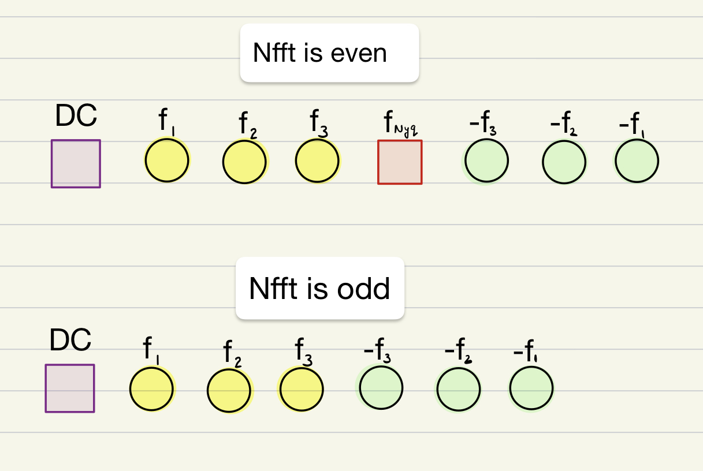

# Interpreting the frequency axis of MATLAB FFT function 
------------------------------

`NFFT = length(x); % length of time series`

`F = FFT(x);`

### 1. If Nfft is even
| Type | Address | comment
|--|--|--|
| DC component | F(1) | --
| Nyquist frequency (fs) | F(end/2+1) | --
| Positive frequencies | F(2:end/2) | Ascending order
| Negative frequencies | F(end/2+2:end) | mirrored to +ve frequency

### 2. If Nfft is odd
| Type | Address | comment
|--|--|--|
| DC component | F(1) | --
| Nyquist frequency (fs) | not included | Highest feequency is fs-df/2 at F(ceil(end/2)), where df is the frequency spacing. Next element is the corresponding negative frequency
| Positive frequencies | F(2:ceil(end/2)) | Ascending order
| Negative frequencies | F(ceil(end/2)+1:end) | mirrored to +ve frequency

### Visual representation

## Eastward and westward zonal wave number in 2D FFT
| wave type | Convention |
|--|--|
| Sine Wave | Positive wavenumber are westward propagating |
| Cosine Wave  | Positive wavenumber are eastward propagating |
| FFT wavenumber axis | Positve wavenumber are westward propagating |

When working with Cosine representation of waves, for positive frequencies, multiply FFT wavenumber axis by -1. Or else, use the negative frquency. 
